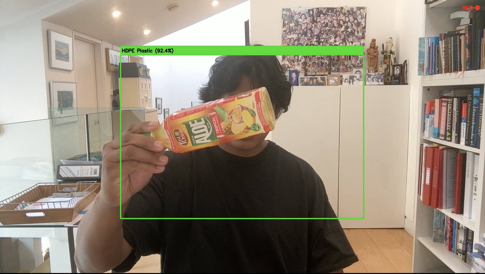

# ♻️ SPARK 
> **AI-powered plastic recognition and automated sorting**

SPARK is a collaborative student-as-a-researcher project developed at the School of Computer Science and Engineering, University of Westminster, London, UK. The team included a lecturer who oversees and guides the students involved in the project; two MSc Applied AI students and two PhD students in Environmental Sciences at the University of Westminster

The project explores how **computer vision, deep learning, embedded systems, and IoT** can be combined to recognise plastic waste and support automated sorting.


[](https://balogunhabeeb14.github.io/SPARK/src/plastisort_demo.mp4)
> **▶️ Click the image above to watch the SPARK prototype demonstration.**

The demonstration shows the deployed **MobileNetV3-Large** model recognising plastic waste as part of the SPARK automated sorting prototype. Plastic waste is difficult to sort automatically because different materials can look very similar, and real-world images are rarely perfect.

SPARK was built to explore a practical question:

> **Can a lightweight AI model running on embedded hardware recognise plastic waste well enough to support an automated sorting system?**

To investigate this, we developed and compared three deep learning models, selected one for deployment, and integrated it into a physical prototype.

The final system uses **MobileNetV3-Large** for plastic classification.


## Machine Learning

Three convolutional neural network architectures were developed and evaluated:

| Model             | Evaluated | Deployed |
| ----------------- | :-------: | :------: |
| EfficientNet-B3   |     ✅     |     ❌    |
| ResNet-50         |     ✅     |     ❌    |
| MobileNetV3-Large |     ✅     |   **✅**  |

### EfficientNet-B3

EfficientNet-B3 was investigated as a high-capacity image classification model and served as one of the comparison points during model evaluation.

### ResNet-50

ResNet-50 was included because of its established performance in image-classification tasks and its use of residual connections to support deeper networks.

### MobileNetV3-Large

MobileNetV3-Large was selected as the **deployment model**.

For SPARK, model selection was not based solely on classification performance. The model also needed to be practical for deployment on embedded hardware, where **memory, computational requirements, and inference speed** are important considerations.

MobileNetV3-Large provided the most suitable balance for the prototype and was therefore used for the final deployment.

---

## Dataset

### WaDaBa Dataset

The primary dataset used for model development and evaluation was the **WaDaBa dataset**.

The SPARK team was **granted access to the dataset for use in this project**. It provided the image data used during the model development and evaluation stages.

The dataset was used to train and evaluate:

* EfficientNet-B3
* ResNet-50
* MobileNetV3-Large

Using a common dataset allowed us to compare the three architectures under the same experimental conditions.


---

## Experimental Evaluation

The project was carried out through **three rounds of experimentation**.

### Round 1 — Model Development

The first round focused on preparing the dataset and developing the three candidate models.

```text
WaDaBa Dataset
      │
      ▼
Pre-processing
      │
      ▼
Training
      │
      ├───────────────┐
      ▼               ▼
EfficientNet-B3    ResNet-50
      │               │
      └───────┬───────┘
              ▼
       MobileNetV3-Large
```

The purpose of this stage was to establish the initial performance of the different architectures on the plastic classification task.

### Round 2 — Model Evaluation & Selection

The second round focused on comparing the models and considering their suitability for the actual SPARK hardware.

We looked beyond model performance alone and considered the practical requirements of running AI on an embedded device.

Following this evaluation, **MobileNetV3-Large was selected for deployment**.

### Round 3 — Real-World Validation

For the final round, we collected our own images of different types of plastic waste using **mobile phones**.

We intentionally captured images with different levels of quality, including:

* Good-quality images
* Poor-quality images
* Different lighting conditions
* Different backgrounds
* Different camera angles
* Different object orientations
* Different distances from the object

This gave us an additional way to test the deployed model outside the controlled conditions of the main dataset.

---

## Real-World Image Collection

The additional mobile phone images were collected by the project team specifically to assess how the model would behave with more realistic inputs.

Instead of testing only clean and well-composed images, we included photographs where the plastic item might be:

* poorly lit,
* partially unclear,
* viewed from an unusual angle,
* surrounded by a distracting background, or
* captured at lower image quality.

This was important because a real sorting system cannot assume that every image will look like a carefully prepared dataset image.

The additional images were used for **validation and testing**, rather than replacing the main WaDaBa dataset.


## Getting Started

Clone the repository:

```bash
git clone YOUR_REPOSITORY_URL
cd SPARK
```

Create a virtual environment:

```bash
python -m venv venv
```

Activate it:

**Windows**

```bash
venv\Scripts\activate
```

**Linux / macOS**

```bash
source venv/bin/activate
```

Install the required packages:

```bash
pip install -r requirements.txt
```


## Acknowledgements

We would like to sincerely thank the **University of Westminster's Student as Researcher Programme** for supporting SPARK and making it possible for us to undertake this project.

The programme gave the opportunity to move beyond classroom-based learning and work collaboratively on a real-world problem, from initial ideas and experimentation through to the development of a working prototype.

We are grateful to the **WaDaBa dataset providers** for granting us access to the dataset and permitting its use for this project. The dataset was an important part of our model development and evaluation.

We also acknowledge everyone who provided guidance, technical support, feedback, and encouragement throughout the development of SPARK.

---

## Project Status

SPARK is currently a working prototype demonstrating AI-based plastic recognition and automated sorting.


## Contact

For questions, feedback, collaboration, or further information about the SPARK project, please contact:[balogunhabeeb14@gmail.com](mailto:balogunhabeeb14@gmail.com)

